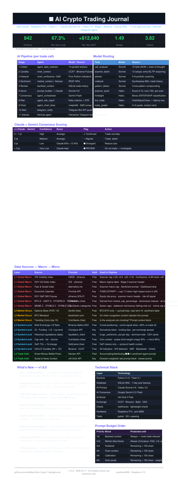

# Trading Journal

> **Disclaimer:** This project was entirely vibe-coded with [Claude Code](https://claude.ai/code) and has not been reviewed by professional developers or security experts. Use at your own risk. Contributions and code reviews are very welcome.

A self-hosted crypto futures trading journal with live Bitget API sync, AI-powered trade call analysis, and deep performance analytics. Runs on a Raspberry Pi (or any Linux box) and is accessible from any browser on your local network.

<p align="center">
  
</p>

<p align="center">
  <a href="https://github.com/anvilfilbert/Auto-Crypto-Tradingjournal/releases/tag/v2.1">🚀 Release v2.1</a>
  &nbsp;·&nbsp;
  <a href="https://github.com/anvilfilbert/Auto-Crypto-Tradingjournal/releases/download/v2.1/trading-journal-factsheet.pdf">📄 Fact Sheet (PDF)</a>
</p>

---

## Features

### Trade Journal
- Full trade history synced automatically from Bitget (USDT-M Futures)
- Import historical data via Bitget CSV export
- Filter by symbol, direction, date range, win/loss
- Edit analyst, notes, and tags on any trade — including old ones
- Manual trade entry for other exchanges or paper trades

### Dashboard
- KPIs: total P&L, win rate, profit factor, average trade, best/worst trade
- Cumulative P&L curve and wallet balance history
- Account equity and available balance (live from Bitget)

### Deep Dive Analytics
- P&L breakdown by symbol, month, day of week, and open hour
- Long vs Short comparison
- Trade duration breakdown
- Useful for spotting patterns in your trading behaviour

### AI Call Analyzer (Claude-powered)
- Paste an analyst's trade call → Claude extracts entry, SL, TP levels, scores the setup, and gives a full briefing
- Optionally attach a chart screenshot for vision analysis
- Saves calls with setup score, R:R, trade type, entry timing grade
- Records outcomes (TP1/TP2 hit, SL hit, manual close) to build a track record
- Per-analyst performance stats: win rate, avg PnL, TP hit rate, score accuracy

### Pending Limits / Shadow Trades
- Track limit orders placed on Bitget that aren't in the journal yet
- Live feed of open Bitget limit orders pulled from the API
- Link limits to analyst calls
- Bulk operations: set SL/TP, link to call, cancel all selected
- Auto-matches triggered limits to journal entries

### Live Positions
- Real-time open positions with unrealised P&L, duration, margin details
- Per-position AI analysis: trade quality, invalidation level, suggested actions
- Pending orders panel (entry limits and exit TP/SL orders)
- **📊 Chart button** on every position — opens a detached, resizable chart window

### Chart Explorer
- New dedicated module: type any symbol to draw a candlestick chart with full TA
- **S/R detection**: swing-pivot clustering shows horizontal grey zones — heavier-tested levels are visibly darker
- **Trendline detection**: ascending support lines and descending resistance lines drawn as dashed diagonals
- **Liquidation levels**: yellow dashed lines showing where open positions get liquidated (auto-detected from live positions)
- **Technical indicator panel**: RSI, MACD, EMA stack, Bollinger Bands, ADX, Stoch RSI, ATR, Volume — shown as metric cards below the chart
- **Pop Out button**: open any chart as a separate resizable window
- Timeframe switcher: 15m / 1H / 4H / 1D

### Auto-Sync
- Background sync every 5 minutes from Bitget API
- Cursor-based position pagination — catches trades regardless of how long they were held open
- Startup catch-up window to recover trades missed during downtime
- Idempotent: safe to sync repeatedly, no duplicates

---

## Tech Stack

| Layer | Technology |
|-------|-----------|
| Backend | Python 3 / Flask 3.1 |
| Database | SQLite (via Python `sqlite3`) |
| Frontend | Vanilla JS SPA (single `index.html`, no build step) |
| Dashboard charts | Chart.js |
| Candlestick charts | LightweightCharts v4.1.3 (TradingView) |
| Technical analysis | pandas-ta |
| AI | Anthropic Claude API (`claude-sonnet-4-6` / vision) |
| Exchange API | Bitget REST API v2 |
| Process manager | systemd |

---

## Requirements

- Python 3.10+
- A [Bitget](https://www.bitget.com) account with API access (read-only keys are sufficient)
- An [Anthropic API key](https://console.anthropic.com) for the AI features
- Linux host (tested on Raspberry Pi 5 with Raspberry Pi OS)

---

## Installation

```bash
git clone https://github.com/anvilfilbert/Auto-Crypto-Tradingjournal.git
cd Auto-Crypto-Tradingjournal
pip3 install -r requirements.txt
```

---

## Configuration

Copy the example env file and fill in your credentials:

```bash
cp .env.example .env
```

Edit `.env`:

```env
BITGET_API_KEY=your_api_key
BITGET_SECRET_KEY=your_secret_key
BITGET_PASSPHRASE=your_passphrase
PORT=8082
```

The Anthropic API key is set separately — the app reads `ANTHROPIC_API_KEY` from the environment or you can add it to `.env`.

### Bitget API key setup

1. Log in to Bitget → **Profile → API Management → Create API**
2. Permissions needed: **Read** only (the journal never places or cancels orders)
3. Copy the API Key, Secret Key, and Passphrase into `.env`

---

## Running

### Directly

```bash
python3 app.py
```

The app starts on `http://0.0.0.0:8082` (or the port set in `.env`).

### As a systemd service (recommended)

Copy the included service file and enable it:

```bash
sudo cp trading-journal.service /etc/systemd/system/
sudo systemctl daemon-reload
sudo systemctl enable --now trading-journal
```

The service uses `EnvironmentFile=` to load `.env` and restarts automatically on failure.

---

## First run

1. Open `http://<your-host>:8082` in a browser
2. Go to **Import** and upload a Bitget CSV export to populate historical trades
3. The background sync will start automatically and keep the journal up to date from that point on
4. Use **Call Analyzer** to start logging analyst calls before you enter trades

---

## Project structure

```
app.py                  Flask startup + blueprint registration (~50 lines)
helpers.py              Shared helpers: _ok, _err, _filters_from_args, strip_fence
database.py             Schema init, migrations, get_conn(), db_conn()
routes/
  journal.py            Positions CRUD, import, symbols, wallet history
  analytics.py          Dashboard KPIs, deep dive, heatmap, patterns, R:R, chart routes
  market.py             Market context, calendar, exchange symbols, mark prices
  calls.py              Call analyzer, saved calls, outcomes, analyst stats
  limits.py             Pending limit orders
  live.py               Live Bitget positions and per-trade AI
  sync.py               Sync trigger, sync status, AI advisor
bitget_client.py        Bitget REST API v2 client (read-only)
bitget_sync.py          Background sync logic
importer.py             Bitget CSV import parser
analytics.py            Dashboard KPIs and deep dive stats
prompt_builder.py       Shared context assembler for all AI modules (budget-capped)
trade_utils.py          Shared trading utilities: sector map, ATR SL check
ai_advisor.py           Full-portfolio AI analysis
ai_call.py              Trade call analysis core (price extraction, sizing, ATR/correlation checks)
ai_limit.py             Pending limit analysis
ai_call_analyzer.py     Re-export shim (backward compat: from ai_call import …; from ai_limit import …)
ai_live_trade.py        Per-trade AI on the live positions view
ai_trade_grader.py      Execution grading via Claude
ai_pattern_detector.py  Statistical pattern detection via Claude
ai_rulebook.py          Self-learning personalised rulebook (synthesised by Claude from trade history)
ai_scanner.py           Proactive setup scanner — 3-stage pipeline, 100-symbol watchlist, 6-10/10 scoring
ai_hindsight.py         Retroactive trade analysis — historical candles, blind scoring, P&L comparison
market_context.py       Fear & Greed, funding rate, L/S ratio + get_market_str() helper
chart_context.py        OHLCV candle fetch + historical snapshots, S/R, trendlines, indicators (pandas-ta)
templates/index.html    Single-page frontend HTML (~960 lines, no inline CSS)
templates/chart.html    Detached chart window (LightweightCharts, S/R, trendlines, entry/SL/TP levels)
static/style.css        All dark-theme CSS
static/js/              Frontend split into 16 topic files (01-utils → 13-init + 08b, 14-scanner, 15-hindsight)
docs/GUIDE.md           Developer reference (routes, schema, JS globals)
docs/USER_GUIDE.md      End-user feature guide
docs/RATING_CRITERIA.md Full reference for all AI scoring and grading criteria
docs/SCORING_GUIDE.md   Per-level scoring rubric — what a 1/10 vs 10/10 setup looks like
.env.example            Environment variable template
trading-journal.service systemd unit file
```

---

## Notes

- The journal is designed for personal use on a local network. There is no authentication layer — do not expose it to the public internet without adding one.
- All AI features require a valid `ANTHROPIC_API_KEY`. The journal works without it — the AI buttons will simply return an error.
- SQLite is sufficient for personal use (one user, <100k trades). No migration to Postgres is needed.

---

## Changelog

### v2.2 — Setup Scanner, Hindsight Analysis & Scoring Guide

#### Setup Scanner (⭐ new nav page)
- **Proactive opportunity finder** — scans 100 USDT-M futures symbols for trade setups scored 6-10/10 without waiting for analyst calls
- **3-stage pipeline**: (1) multi-TF confluence filter — parallel fetch of 4H+1D signals, passes symbols with ≥2 aligned; (2) technical quality gate — rejects choppy ADX, overextended RSI, missing S/R structure; (3) AI scoring — Claude evaluates finalists with full context, returns only 6-10/10 setups
- **Results table** with columns: score, symbol, direction, confluence summary, chart pattern, entry zone, R:R, urgency
- **Click any row** to expand a detail panel: entry zone + structural rationale, stop loss + ATR distance explanation, TP1 + TP2 each with target level explanation, "Why X/10" score reasoning block, key conditions and risk badges
- **Chart with levels** — opens the detached chart window with entry zone, SL, TP1, TP2 pre-drawn as price lines
- **Results cached 30 min**, Re-scan button for fresh data; 100-symbol watchlist covers BTC/ETH, major L1s, L2s, DeFi, AI, Meme, Gaming, Solana ecosystem

#### Hindsight Analysis (🔮 new nav page)
- **Retroactive blind scoring** — fetches historical Bitget candles at each trade's exact entry time, reconstructs the technical picture as it was at that moment, and asks Claude to score the setup without knowing the outcome
- **Full comparison**: actual P&L vs "following recommendations" P&L (skipping trades Claude would have scored below 5)
- **Signal accuracy** — TP/FP/TN/FN verdicts per trade; accuracy = (TP+TN) / all strong-signal trades
- **Results stored in `trade_hindsight` DB table** — persistent across sessions; re-run at any time for fresh analysis
- **Summary view**: 4-column comparison (Actual | Recommendations | Signal Accuracy | Score vs Outcome) with a key insight line showing P&L difference, win-rate change, and savings from skipped low-quality trades
- **Trade-by-trade table** with score badge, recommendation (ENTER/SKIP), hypothetical P&L, delta, and verdict badge

#### Scoring Guide (`docs/SCORING_GUIDE.md`)
- New standalone reference document: exact criteria for every score level 1-10
- Per-score detailed breakdown with real examples for each level
- Factor grids: confluence, entry quality, SL distance (ATR), R:R benchmarks, RSI at entry, multi-TF alignment
- Common mistakes table (what specific errors cost how many points)
- "What separates a 7 from a 9" section

#### Telegram Alerts + Scheduled Scanner
- **Automatic 30-minute scans** — `scanner_scheduler.py` starts a background daemon thread at app startup, fires `force_scan()` every 30 minutes (first scan 5 min after boot)
- **Telegram notifications** — `telegram_notify.py` sends an HTML-formatted alert when any 6+/10 setup is found; includes symbol, direction, score, entry/SL/TP, R:R, urgency, and a deep-link back to the journal
- **No external dependencies** — uses only `urllib.request` (stdlib)
- **Live Sync page** — new Telegram Alerts section shows configured/unconfigured status and a "Send Test Message" button to verify the connection
- **New API endpoints**: `GET /api/telegram/status`, `POST /api/telegram/test`
- **Config in `.env`**: `TELEGRAM_BOT_TOKEN`, `TELEGRAM_CHAT_ID`, `APP_URL`; optional overrides `SCANNER_INTERVAL`, `SCANNER_FIRST_DELAY`, `SCANNER_SCHEDULER=off`

#### Call Analyzer legend
- **"ℹ How to read the results"** collapsible panel on the Call Analyzer page — explains every element in the analysis output: score tiers (1-10 with colour coding), R:R ratio in plain English, DCA, trade types, entry timing, ATR Risk warning, Portfolio Correlation warning, Candle-Close SL and why Bitget can't automate it, Personal Pattern Warnings (yours, not generic), all position sizing terms, Optimizations vs Risks

#### Bug fixes (from code audit)
- `settings` table missing from `init_db()` — `ai_rulebook` crashed on fresh installs
- Malformed regex in `ai_call._extract_price()` — `{0,20}` quantifier was inside character class (wrong) instead of after it
- Scanner Stage 2 passed 86/100 symbols to Claude — tightened ADX/RSI thresholds, added 4H signal check, capped at 30
- `ai_advisor.py` leaked DB connection on exception
- `ai_limit.py` ThreadPoolExecutor `.result()` calls outside the `with` block
- Hindsight lookahead bias in history query fixed

---

### v2.1 — AI Accuracy, Performance & Code Quality

#### AI Accuracy
- **Multi-TF confluence scoring** — `confluence_score()` in `chart_context.py` aggregates RSI/MACD/EMA/ADX direction signals across timeframes; injected as a single CONFLUENCE line in every AI prompt
- **ATR-aware SL check** — call analyzer and limit analyzer warn when the stop-loss distance is smaller than the 1H ATR noise floor (< 0.5× ATR = "inside noise"; < 1× ATR = "tight stop")
- **Portfolio correlation check** — call analyzer detects same-sector/same-direction concentration across open positions (6 named sectors: BTC, ETH/L2, SOL/L1, Meme, DeFi, AI/Infra)
- **Richer score calibration** — `get_calibration_for_prompt()` now shows entry rate per score tier alongside TP1/SL outcome rates and an actionable verdict (→ ENTER / → SKIP)
- **Shared prompt builder** — `prompt_builder.py` assembles rulebook + calibration + chart context + similar trades into a budget-capped context block (5 600 chars ≈ 1 400 tokens), used by all four AI modules
- **Stats pruning** — `ai_advisor.py` strips empty arrays, caps `by_symbol` to top 10, caps `by_hour` to the 8 most-differentiated hours before serialising to the prompt (~30% size reduction)
- **Compact chart format** — `format_for_prompt()` rewritten from ~15 lines per TF to one dense line (e.g. `BTCUSDT 4H: RSI 58(neu) | MACD bull | EMA ↑all | ADX 28↑ | ATR 1.2%`)

#### Performance
- **No double indicator computation** — `confluence_score()` now accepts a pre-computed `ctx` dict; `prompt_builder` passes the already-fetched result, avoiding a second round of `pandas-ta` per timeframe per request
- **Parallel ATR + market context** — `ai_call.py` and `ai_limit.py` fetch the 1H ATR chart and market context (fear/greed + funding) concurrently via `ThreadPoolExecutor`
- **`detect_all_trendlines()`** runs all 4 TF fetches (1W/1D/4H/1H) concurrently — ~4× faster chart loads
- **`get_chart_context()`** parallelises multi-TF indicator computation the same way
- **Thread-safe caches** — `chart_context.py` and `routes/market.py` price cache both protected by `threading.Lock`

#### New AI modules
- **`ai_call.py`** — call analysis core split from `ai_call_analyzer.py`; fixes a `setup_type` NameError bug from the original
- **`ai_limit.py`** — pending limit analysis, previously missing and causing 500 errors
- **`ai_call_analyzer.py`** — converted to a 3-line re-export shim for backward compatibility
- **`trade_utils.py`** — shared `SECTORS` dict and `atr_sl_warning()` extracted from duplicated private copies; sectors synced with JS (MOGUSDT, POPCATUSDT, COMPUSDT added)
- **`helpers.strip_fence()`** — single canonical markdown-fence stripper replaces 5 duplicated inline blocks; fixes a buggy variant in `ai_advisor.py` and a weaker one in `ai_rulebook.py`

#### New route: `routes/market.py`
- Market context, economic calendar, exchange symbols, and mark prices split out of `routes/analytics.py` into their own Blueprint

#### UX & Charts
- **Multi-TF trendlines** — `detect_all_trendlines()` fetches 1W/1D/4H/1H; visual weight system (heavier/more opaque = higher timeframe); real-time slope extension using price-per-second so weekly lines display correctly on 15m charts
- **Live trade chart levels** — `openChart()` passes entry, SL, TP1, TP2 as URL params; `chart.html` renders each as a `createPriceLine()` with colour coding and legend chips showing % distance from mark
- **Searchable symbol picker** — live-filter dropdown on every coin input (Chart Explorer, Add Trade, Log Manual Trade); two-variant architecture (absolute vs fixed) handles modal `overflow:hidden` clipping
- **Cross-page awareness** — open position cards show `⏳ N limit(s)` chip when waiting limits exist; clicking navigates to Pending Orders
- **Proximity alerts** — limits within 5% of current mark price show `📍 X.X% from limit` badge (red/yellow/blue thresholds)
- **Chart Explorer title overlay** — coin name and active timeframe shown as a top-left overlay; updates on every draw/TF switch
- **Mouseover tooltips** — all Dashboard KPIs, Live Trades KPIs, and Chart Explorer indicator cards have `data-tip` explanations
- **JavaScript split** — `static/app.js` split into 14 focused files under `static/js/`
- **Dashboard parallel fetch** — `loadDashboard()` fires KPI + market context + live positions in a single `Promise.all`

#### Bug fixes
- `setup_type` NameError in original `ai_call_analyzer.py` — variable referenced before assignment
- `analyze_pending_limit()` function was missing — route called it but it was never implemented
- DB connection leak in three AI modules — `get_conn()` without context manager leaked write-lock on any exception

---

### v2.0 — Interactive Charts & S/R Intelligence

#### Detached Chart Window
- **`📊 Chart` button** on every live position card — opens a resizable, detached chart window (`window.open`) instead of a cramped in-page modal
- Chart window is reused per symbol — clicking the same coin a second time focuses the existing window rather than opening a new one
- Timeframe switcher (15m / 1H / 4H / 1D) inside the chart window — reload in place without reopening

#### S/R Detection
- **Swing-pivot clustering** (`detect_support_resistance()` in `chart_context.py`) — identifies local highs/lows, clusters nearby pivots, and counts touches per level
- **Grey box rendering**: S/R levels are drawn as horizontal filled rectangles on a `<canvas>` overlay — opacity scales with touch count (lighter = fewer touches, darker = more tested)
- **Right-axis labels**: each level shows type (`S`/`R`) and touch count directly on the price axis
- S/R summary injected into all AI prompts (live position analysis, call analyzer) via `format_for_prompt()`

#### Trendline Detection
- **`detect_trendlines()`** in `chart_context.py` — finds ascending support lines and descending resistance lines using swing-pivot pairs; validates each pair (no candle violates the line within 0.5% tolerance)
- Up to 2 uptrend + 2 downtrend lines per chart
- Trendlines drawn as dashed diagonal lines: green for uptrend, red for downtrend
- Legend shows direction, touch count, and anchor price range

#### Liquidation Levels
- **Yellow dashed lines** on every chart showing where each open position would be liquidated
- Auto-populated from live positions data; passed to the chart window as URL params
- Labels show direction (Long/Short) and exact liquidation price

#### Chart Explorer (new nav module)
- **Dedicated page** — type any symbol, pick a timeframe, click Draw to render a full candlestick chart
- All S/R, trendlines, and liquidation overlays from live positions apply automatically
- **Indicator panel** below the chart: RSI, MACD signal, EMA stack alignment, Bollinger %B, ADX, Stoch RSI, ATR, Volume ratio — shown as metric cards with colour-coded values
- **Pop Out** button opens the current chart as a detached resizable window
- Symbol autocomplete populated from your full trade history

#### Canvas Overlay Architecture
- S/R boxes and liquidation lines rendered on an absolutely-positioned `<canvas>` on top of LightweightCharts — stays in sync with pan/zoom via `requestAnimationFrame` loop
- Loop auto-stops when the canvas is removed from the DOM (chart destroyed / TF switch)
- Price-scale area (right ~65px) deliberately left uncovered so axis labels remain readable

---

### v1.9 — Technical Analysis & AI Foundation
- **`chart_context.py`** — new module: pulls OHLCV candles from Bitget and computes a full indicator suite via `pandas-ta` (no extra API key needed — uses existing Bitget auth)
- **Indicators computed per symbol × timeframe**: RSI(14), MACD(12,26,9), EMA 20/50/200 + stack alignment, Bollinger Bands(20,2) with percentile position, Stochastic RSI(14), ADX(14) with +DI/−DI direction, ATR(14) as % of price, volume vs 20-period average, last 3 candle descriptions (bullish/bearish/doji)
- **Auto-injected into Live Position AI** (4H + 1D) — Claude now references indicators when recommending Hold / Adjust SL / Close Now
- **Auto-injected into Call Analyzer** (4H + 1D) — Claude cross-references the call with live technicals before scoring
- **10-minute in-memory cache** per (symbol, timeframe) — no repeated Bitget calls within a session
- **New API endpoint** `GET /api/chart/indicators?symbol=BTCUSDT&timeframes=4H,1D`
- **`docs/RATING_CRITERIA.md`** — complete reference documenting every AI scoring and grading criterion used across all six systems
- **Bug fix**: `analyze_call()` missing `market_regime` parameter caused 500 error on every call analysis request
- `pandas` and `pandas-ta` added to `requirements.txt`
- **`ai_rulebook.py`** — new module: Claude analyses your entire trade history and synthesises 5–10 personalised rules (warnings, strengths, habits, calibration notes) backed by real numbers from your data
- **`trader_rulebook` DB table** — rules persisted in SQLite; auto-regenerated weekly by the background sync loop
- **Rulebook + calibration data + similar trades** injected into every AI prompt (live position analysis, call analyzer, AI advisor)
- **Edge Lab UI** — "Trader Rulebook" section with Generate/Update button; rules displayed as colour-coded cards with confidence level and trade count
- **New API endpoints**: `GET /api/rulebook`, `POST /api/rulebook/update`

### v1.8 — Architecture Refactor
- **Flask Blueprints** — `app.py` reduced from 1158 to 52 lines; all routes split into `routes/` by domain: `journal`, `analytics`, `calls`, `limits`, `live`, `sync`
- **`db_conn()` context manager** — every route now uses `with db_conn() as conn:`, guaranteeing connection close on exception. Added to `database.py`
- **CSS extracted** — `templates/index.html` no longer contains inline CSS; all styles moved to `static/style.css` (cacheable, easier to edit)
- **Shared helpers** — `helpers.py` provides `_ok()`, `_err()`, `_filters_from_args()` to all blueprints
- **`analyst` migration consolidated** — moved from `app.py` startup into `database.py → init_db()` with all other column migrations

### v1.7 — Trading Tools & Heatmap
- **Position Sizing Calculator** — inline in Call Analyzer: enter Entry + SL, risk % auto-populates from account equity, shows Position Size / Leverage / Risk Amount / Risk Distance. Auto-fills entry and SL after every call analysis.
- **Economic Calendar** — fetches this week's high-impact USD events (ForexFactory, no API key). Yellow warning banner on Live Positions when events fall today or tomorrow. 
- **Trade Heatmap** — 7×24 grid in Deep Dive showing win rate by open hour (UTC) and close day. Color-coded: green ≥65% · blue 50–64% · yellow 40–49% · red <40%. Cells need ≥3 trades to activate.
- **BTC Dominance** — added to Dashboard Market Pulse strip via CoinGecko free API. Rising dominance shown in red (bad for alts), falling in green.

### v1.6 — Market Intelligence & Strategy
- **Fear & Greed Index** — live 0-100 sentiment score from alternative.me shown in a Market Pulse strip on the Dashboard
- **Bitget Funding Rate** — per-symbol, shown as chip on every Live Positions card; injected into per-position Claude analysis
- **Bitget Long/Short Ratio** — retail positioning per symbol on Live Positions cards; injected into analysis
- All three sources feed Claude's trade grading, per-position analysis, and full AI Advisor
- New module `market_context.py` with 5-minute in-memory cache; new `GET /api/market/context?symbols=` endpoint
- **Analyst Leaderboard** — Edge Score (0-100) ranks analysts by composite metric: 50% trade win rate + 30% call outcome win rate + 20% TP1 hit rate. Color-coded rows, medal rankings, TP1 hit rate and conversion rate columns.
- **Correlation Detector** — groups open positions by sector (Bitcoin / ETH+L2 / SOL+L1 / Meme / DeFi / AI+Infra); two-tier severity: yellow (2 positions same sector/direction), red (3+)
- **AI Pattern Detector** — Claude analyses full trade history by setup type, session, weekday, direction, duration, grade; returns warnings, insights, and strengths

### v1.5 — Trading Precision & Edge Lab
- **AI Execution Grading** — click ⚡ Grade on any trade; Claude assigns A/B/C/D with a written explanation based on entry quality, exit discipline, and realized R:R
- **Setup Type Tagging** — label trades as Breakout, Pullback, Trend Continuation, Range Fade, Reversal, News/Event, or Other; Deep Dive shows P&L and win rate broken down by setup type
- **Planned vs Realized R:R** — link a trade to an analyst call; Deep Dive computes and displays planned R:R vs what was actually achieved
- **Edge Lab** — Deep Dive split into two pages; Edge Lab adds setup analysis, grade breakdown, pattern detector, R:R tracking
- **Setup Type filter in Journal** — filter by specific setup or ⚪ Untagged; setup captured in Add Trade modal for manual trades
- New backend module `ai_trade_grader.py`; new API routes `POST /api/positions/<id>/grade` and `GET /api/analytics/rr`

### v1.4 — Code Quality & Security
- `SECURITY.md` added — lightweight vulnerability reporting policy via GitHub private advisories
- CodeQL workflow added (`.github/workflows/codeql.yml`) — analysis now actually runs on push, PR, and weekly; branch protection is fully operational
- Frontend JS extracted from `templates/index.html` into `static/app.js` — `index.html` reduced from 3348 to 1078 lines
- Security fix: incomplete string escaping in `static/app.js` — backslashes now escaped before single quotes in analyst name interpolation (CWE-116)

### v1.3 — Repository Hardening
- Branch protection on `main` — CodeQL must pass before merge
- Dependabot weekly pip dependency updates
- Squash merge only — cleaner commit history
- LICENSE fixed to standard GPL v3 (was showing as unrecognised)
- Secret scanning alert resolved — old revoked API key removed from history
- Dependencies bumped: Flask 3.1.3, Anthropic SDK 0.100.0

### v1.2 — Security Fixes
- Stack trace exposure fixed — exception details no longer returned to the client (CWE-209)
- Path traversal fixed — uploaded filenames sanitized with `secure_filename` before use (CWE-022)
- SQL filter inputs now validated with an allowlist before reaching the query layer (CWE-089)

### v1.1 — Privacy, Fixes & Polish
- **Open Position Risk** now shows true SL-based dollar risk instead of margin locked
- Recent trades table has a totals footer (sum of P&L and fees)
- Added 📈 favicon
- Dashboard monthly P&L was showing 0 — fixed
- Removed personal identifiers from all public files and docs
- systemd service template updated with `EnvironmentFile=` and generic placeholders

### v1.0 — Initial Release
- Full trade journal synced from Bitget USDT-M Futures
- Dashboard KPIs, P&L curve, equity curve, streak tracker, monthly target
- Deep Dive analytics by symbol, month, weekday, hour, direction, duration
- AI Call Analyzer: paste analyst call → Claude scores setup, tracks outcomes
- Pending Limits / Shadow Trades with bulk operations and AI analysis
- Live Positions with per-trade Claude analysis
- Background auto-sync every 5 minutes (cursor-based, no gaps)
- Analyst performance stats across journal, calls and pending limits

---

## License

GNU General Public License v3.0 — see [LICENSE](LICENSE) for details.
